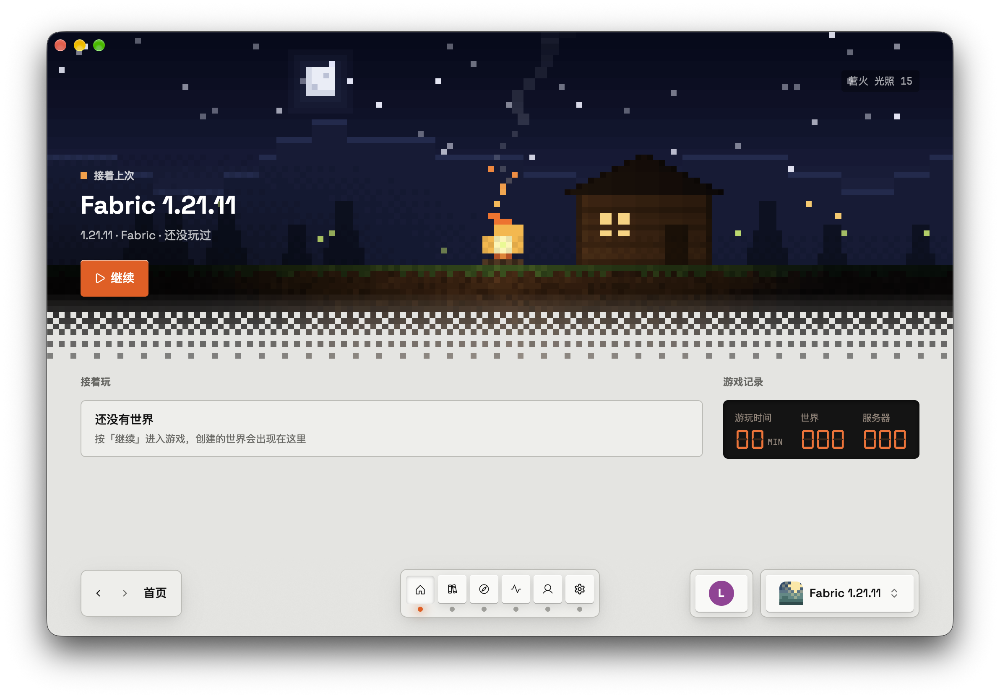
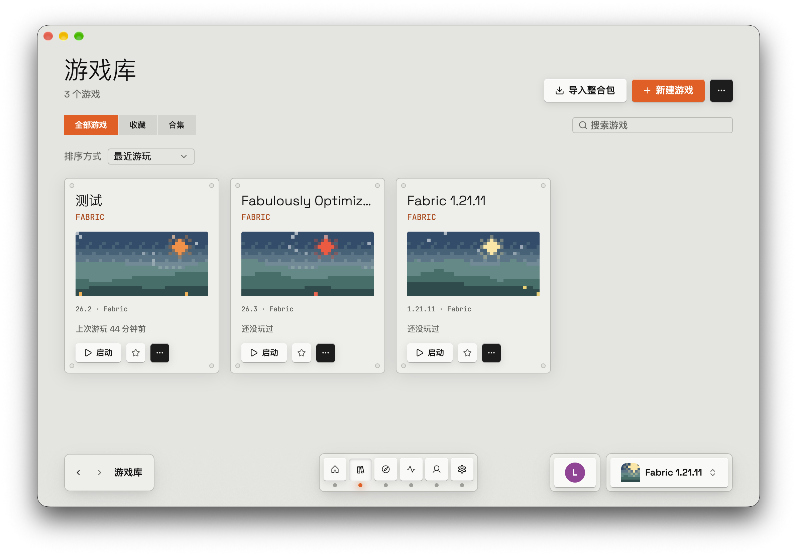
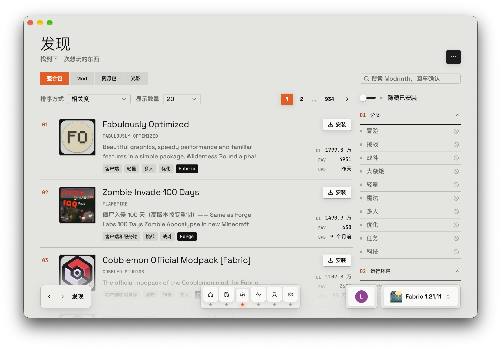

<div align="center">


# LumilioCL

一个用 Rust 写的原生 Minecraft 启动器。

[](https://github.com/EdwinZhanCN/LumilioCL/actions/workflows/ci.yml)
[](https://github.com/EdwinZhanCN/LumilioCL/releases/latest)
[](LICENSE)


简体中文 · [English](README.en.md)

</div>

## 简介

LumilioCL 使用 Rust 开发，桌面界面基于 [GPUI](https://www.gpui.rs/) 与
[gpui-kit](https://github.com/longbridge/gpui-kit) 构建，底层组件使用本仓库维护的
gpui-component 0.7 Fork。桌面应用不依赖 Electron 或 WebView。

- **游戏库**：新建原版、Fabric 或 Quilt 游戏，用收藏、合集和搜索管理。可以导入 `.mrpack`
  和 MultiMC / Prism 整合包，也可以把其他启动器（MultiMC、Prism、`.minecraft`）里的游戏搬
  过来，原文件不动。
- **发现**：浏览并安装 Modrinth 上的模组、资源包、光影和整合包，按游戏版本和加载器筛选。
- **Java**：自动下载并管理每个游戏需要的 Java，不用自己装。
- **账户**：离线账户（可以换皮肤），以及 LittleSkin 等第三方认证服务器。
- **游戏页**：管理内容、世界和服务器，查看截图和启动历史，做完整备份和恢复。游戏崩溃时，
  诊断页会说明可能的原因。
- **世界地图**：查看种子预测、存档地图和 Xaero 地图，叠加结构物及路径点等图层。
- **内置插件**：崩溃分析、Litematica 投影（材料清单和 3D 预览）、Modrinth 内容源、世界地图与 Discord 状态显示（默认关闭）。社区 WASM 插件尚在规划中，当前不支持独立安装第三方插件。

> [!NOTE]
> Microsoft 正版登录的流程已经做好，这个启动器应用注册已经通过 Mojang 审批。
> 同时，你也可以使用离线账户或第三方登录。

## 画廊

<div align="center">

<table align="center">
  <tr>
    <td align="center" width="33%"><a href="assets/screenshots/home.png"></a></td>
    <td align="center" width="33%"><a href="assets/screenshots/game-library.png"></a></td>
    <td align="center" width="33%"><a href="assets/screenshots/discovery.png"></a></td>
  </tr>
</table>

</div>

## 获取

到 [Releases](https://github.com/EdwinZhanCN/LumilioCL/releases/latest) 下载对应系统的文件：

| 系统 | 下载哪个 | 要求 |
| --- | --- | --- |
| macOS | `LumilioCL-<版本>-macos-arm64.dmg` | Apple 芯片（M1 及更新），macOS 11 或更新；暂不支持 Intel Mac |
| Windows | `LumilioCL-<版本>-windows-x64-setup.exe`（安装版，推荐）<br>`LumilioCL-<版本>-windows-x64-portable.zip`（免安装，解压即用） | Windows 10 / 11，64 位 |
| Linux（Debian、Ubuntu 等） | `LumilioCL-<版本>-linux-x64.deb` | 64 位，Ubuntu 22.04 / Debian 12 或更新，需要能用的 Vulkan 显卡驱动 |
| Linux（其他发行版） | `LumilioCL-<版本>-linux-x64.tar.gz` | 同上 |

安装方法：

- **macOS**：打开 `.dmg`，把 LumilioCL 拖进「应用程序」文件夹。
- **Windows**：双击 `setup.exe` 一路下一步，不需要管理员权限。免安装版解压到任意位置后，
  双击 `lumiliocl.exe`。
- **Linux `.deb`**：在下载目录运行 `sudo apt install ./LumilioCL-<版本>-linux-x64.deb`。
- **Linux `.tar.gz`**：解压后运行里面的 `./install.sh`，只装给当前用户，不需要 root。卸载时
  运行 `./install.sh --uninstall`。

卸载 LumilioCL 不会删除你的游戏和存档，它们保存在这些位置：macOS 是
`~/Library/Application Support/LumilioCL`，Windows 是 `%APPDATA%\LumilioCL`，Linux 是
`~/.local/share/lumilio`。

## 第一次打开时系统弹出警告？

**请先确认安装包来自本仓库的 GitHub Releases。**

发布流程支持可选的代码签名和 macOS 公证；未签名或缺少系统信任记录的安装包，可能触发
macOS Gatekeeper 或 Windows SmartScreen 提醒。此类提醒并不直接证明文件恶意，
但也不能作为文件安全的保证。LumilioCL 的源码与 GitHub Actions 构建流程均公开，
安装前建议核对发布来源与 SHA-256。

### macOS

1. 在「应用程序」里双击 LumilioCL。弹出「无法打开 "LumilioCL"」时，点 **完成**，
   不要点「移到废纸篓」。
2. 打开 **系统设置 → 隐私与安全性**，滑到页面最下方，可以看到「已阻止打开 LumilioCL」。
   点旁边的 **仍要打开**，输入电脑的开机密码。
3. 在再次弹出的窗口里点 **打开**。

之后它就和普通应用一样，双击就能打开。

<details>
<summary>macOS 14 或更早的系统</summary>

在「应用程序」里按住 Control 键点 LumilioCL（或者右键点它），选 **打开**，再点一次 **打开**。

</details>

<details>
<summary>提示「已损坏，无法打开」</summary>

该提示也可能由下载损坏或安全校验失败引起，并不一定只是签名问题。请先从官方 Releases
重新下载并核对 SHA-256。仅在确认文件来源可信、问题确实与隔离标记有关时，才考虑在「终端」
运行下面的命令移除该应用的隔离标记：

```sh
xattr -dr com.apple.quarantine /Applications/LumilioCL.app
```

然后再双击打开。

</details>

### Windows

1. 如果浏览器提示「不常下载」：在 Edge 里点该下载右边的 **…** → **保留** → **仍然保留**。
2. 运行时如果出现蓝色窗口「Windows 已保护你的电脑」：点 **更多信息**，再点 **仍要运行**。

### Linux

系统提示取决于发行版与桌面环境，请按上述说明安装。

### 想确认下载的文件没被改过？

每个 Release 都附有 `SHA256SUMS.txt`，里面是每个文件的「指纹」。把它和安装包放在同一个
文件夹，然后运行：

- macOS：`shasum -a 256 -c SHA256SUMS.txt --ignore-missing`
- Linux：`sha256sum -c SHA256SUMS.txt --ignore-missing`
- Windows（PowerShell）：`Get-FileHash .\文件名 -Algorithm SHA256`，再把结果和
  `SHA256SUMS.txt` 里对应的那一行比对。

显示 `OK`，或者两串字符一致，说明文件与 Release 提供的校验值相符；这并不能单独证明发布者身份。

## 参与开发

```sh
cargo run -p lumilio-app   # 运行
just check                 # 构建、测试、clippy、rustfmt，和 CI 一致
just package               # 为当前平台打包到 dist/
```

- 开发约定见 [`AGENTS.md`](AGENTS.md)；工作区：`lumilio-core`（与界面无关的启动器逻辑）、`lumilio-ui`（GPUI / gpui-kit 界面）、`lumilio-app`
  （进程启动和组装）、`lumilio-schematic-render`（原生投影渲染）、`lumilio-plugin-*`（插件），
  以及 `lumilio-xtask`（发布打包）。
- 用 `LUMILIO_HOME=/tmp/<任意文件夹>` 换一个一次性的数据目录。
- 启动器现在能做什么，见从代码生成的 [`docs/ia/paths/`](docs/ia/paths/README.md)；正在进行的
  工作在 [`.agents/plans/`](.agents/plans/README.md)；界面、动效和文案遵循
  [`docs/design-language.md`](docs/design-language.md)。
- 网站与下载代理位于 `web/`（Astro + React + Cloudflare Worker），运行 `just web` 验证。
- 发布：推送和工作区版本一致的 `v<版本>` 标签（SemVer），会在三个平台上打包并创建草稿
  Release，详见 [`assets/icons/PACKAGING.md`](assets/icons/PACKAGING.md) 和 ADR 0032。

<details>
<summary>界面审阅用的环境变量（只影响当次运行）</summary>

- `LUMILIO_PAGE` 直接打开某个页面，例如 `library:2`、`discover:1`、`activity`、
  `instance:1:4:1`（编号、分区、子标签，从 0 开始）。
- `LUMILIO_INSTANCE=<id>`（配合 `LUMILIO_INSTANCE_TAB`、`LUMILIO_INSTANCE_GROUP`）和
  `LUMILIO_PROJECT=mod/sodium` 打开某个游戏或项目详情。
- `LUMILIO_REVIEW_APPEARANCE=light|dark`、`LUMILIO_REVIEW_MIN=1`（720×480）、
  `LUMILIO_REVIEW_STILL=1`（减少动效）。

</details>

## 许可证

LumilioCL 以 GNU Affero 通用公共许可证第 3 版（`AGPL-3.0-only`）发布，见 [`LICENSE`](LICENSE)。

AGPL-3.0-only 有几个比较明显的地方，简单说一下：

- 这是一份 **强著佐权（copyleft）** 许可证：你可以自由使用、修改和分发 LumilioCL，但分发时
  必须保留同样的许可证，并附上完整的源码。
- 它比 GPL 多了一条**网络条款**：如果把这个程序的修改版放到服务器上，让别人通过网络使用，
  那么你也必须向这些用户提供对应的源码。自己在本机改着用不受影响。
- **不提供任何担保**：软件按「原样」给出，作者不对使用后果负责。
- 许可证用**英文原文**为准，上面只是便于理解的说明，不构成法律意见；具体条款以
  [`LICENSE`](LICENSE) 为准。

改编自上游的代码，都在所在文件或函数的注释里写明了来源和许可证。内置字体和图标的许可证见
[`crates/lumilio-ui/assets/ATTRIBUTIONS.md`](crates/lumilio-ui/assets/ATTRIBUTIONS.md)，
原生渲染依赖的许可证见 [`ATTRIBUTIONS.md`](ATTRIBUTIONS.md)。

## 致谢

- **[Modrinth App](https://github.com/modrinth/code)**：它的 Rust 启动器后端 `app-lib`，是
  LumilioCL 实现认证、Java 运行时、实例、整合包和进程管理时首先参考的地方。部分代码改编自它
  （GPL-3.0-only）。LumilioCL 没有使用 Modrinth 的品牌。
- **[HMCL](https://github.com/HMCL-dev/HMCL)**：在功能广度、平台差异和各种边界情况上，
  它是 LumilioCL 最主要的参考。部分代码改编自它（GPL-3.0-or-later）。
- **[Nucleation](https://github.com/Schem-at/Nucleation)**（Schem-at，MIT）：Litematica 投影的
  解析、网格和 GPU 渲染。
- **[Schematic-Mesher](https://github.com/Schem-at/Schematic-Mesher)**（Schem-at，AGPL-3.0-only）：
  方块几何、液体和箱子等的网格生成。

后两个项目以可编辑源码快照的形式维护在 [`forks/`](forks/README.md)，那里记录了基线版本和本地改动。
感谢这些项目的作者和贡献者。
