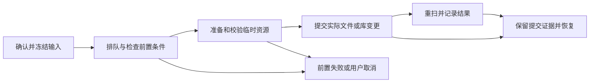

# 状态、提交、恢复与验收

[返回入口](README.md) · [HMCL 对照](hmcl-reference.md) · [实例生命周期](instance-lifecycle.md) · [游玩与内容](play-and-content.md) · [App State](../app-state.md)

本文件把用户流程接到 App State 的目标契约。表中的语义阶段与结果是设计词汇，未要求实现同名枚举，也不表示 P1/P2/P3 已完成。当前实现证据在最后两节。

## 1. 状态所有权与重启边界

| 状态 | 权威来源 / owner | 消费者 | 重启后行为 |
|---|---|---|---|
| 实例配置、名称、收藏、集合 | launcher.db / core store | Library、Home、Instance | 读库恢复；缺目录保留记录并报告 |
| 全局默认、离线身份、源配置 | settings.json / core settings | 账户入口、设置、操作配置快照 | 按 schema 读取；实例覆盖优先 |
| 实际内容、世界、游戏配置 | profile 的实际文件 / 游戏和领域文件操作 | Content、Worlds、Diagnostics | 重扫；不用数据库覆盖游戏修改 |
| 已安装依赖、Java、完整性 | meta、runtimes、校验结果 / 安装和运行时服务 | 安装、启动、修复 | 核对文件和平台；完整依赖离线可用 |
| 变化、会话、快照 | history.jsonl、snapshots / 相应领域 | History、Home | 保留并容错读取；不是当前文件真相 |
| 已完成活动 | activity.jsonl / activity log | Activity、诊断 | 只恢复结果，不恢复可执行任务 |
| 未完成副作用的证据 | operations 日志及提交状态 / 操作协调（P3 目标） | Activity、启动恢复、Diagnostics | 对照文件后恢复或标 interrupted，禁止直接重放 |
| 正在执行的任务、取消、网络响应 | core 服务内存 | Activity、发起页面 | 旧句柄失效；重建操作需要独立核对 |
| 进程、就绪状态、当前会话监督 | core process / 内存及可验证事实 | Home、Overview、History | 重新探测；PID 本身不足以接管 |
| 账户秘密 | 系统凭据库（未来） | 认证服务 | 重新读取；不可用则登录或本次会话身份 |
| 当前页、查询、焦点、滚动 | UI 内存 | 页面 | 默认不持久化；window.json 只恢复几何信息 |

路径、配额、跨平台目录、迁移顺序不在此重复定义，统一见 App State。

## 2. 分开建模的业务事实

| 对象 | 必须区分的语义 | 不能推断什么 |
|---|---|---|
| 实例登记 | 存在、待删除、已删除；目录正常/缺失/扫描中 | 存在记录不表示已安装 |
| 安装与完整性 | 未安装、安装中、完整、不完整、未校验、校验失败 | installed 布尔值不保证现在能启动 |
| 内容检查 | 未知、最新、可更新、不可识别、不支持、检查失败 | 没有候选不总是“最新” |
| 任务 | 等待、运行、终结；前置失败的阻塞 | running task 不表示 running game |
| 启动尝试 | 检查/准备、创建进程、等待就绪、失败或取消 | 下载 100% 或 PID 不表示游戏就绪 |
| 游戏会话 | 运行、请求停止、已结束及原因 | 发出 stop 不表示进程已经结束 |
| 认证 | 无身份、授权等待、可用、过期、服务失败 | 有公开账户记录不表示凭据有效或有离线资格 |
| 页面 | loading、empty、ready、error；可选只读 | UI 路由或 spinner 不是持久业务状态 |

这些事实分别由领域拥有，通过只读投影组合展示，不用一个全局 AppState 枚举包揽全部生命周期。

## 3. L-OPS-01 — 操作、进度、冲突与取消

参考：H-TASK-01/02、H-INSTALL-09、H-CONTENT-07；入口 Activity 的 Downloads/Installs/Updates/Repairs，并由发起页面观察同一操作。

一次执行必须明确：operation/attempt 身份、绑定目标、输入版本/校验信息、阶段、进度依据、取消政策、提交结果和可定位错误。日志不得记录秘密。失败之后用户重试是一项新的执行或明确的新 attempt，不能把旧终态改回 running。

图表示业务边界，不是当前 scheduler 的状态转换定义。当前活动规则仍见 [activity-transfer](../behavior/activity-transfer.md)。

- 进度只反映有依据的 bytes/items/stages；未知总量展示不确定，不编造百分比。跨阶段的进度不能倒退到误导用户的整体完成值。
- 成功表示本操作要求的提交完成，失败必须携带实际已变更的范围；批量结果逐项展示，整体不能掩盖部分成功。
- 页面关闭、路由切换和窗口隐藏不取消业务任务。用户显式取消才发令牌；不可安全中止的提交阶段显示不可取消/正在完成，不谎称已取消。
- 提交前取消清理本次临时文件，保留旧用户内容；已完成的共享资源可保留。提交后不能仅删除日志并回到原状态，必须记录事实并恢复。
- 同一实例的启动、安装、更新、删除、快照恢复需要协调；游戏运行时默认阻止可变文件的破坏性/一致性操作，直到计划定义并证明更细的安全边界。读列表不因此全部阻塞。
- 单 data 根的写锁和共享资源键锁是 App State P3 目标；锁排序、粒度与运行会话引用要在实施计划冻结，不能用 PID 文件代替系统锁。
- 上述拒绝规则必须由 core 检查；禁用按钮只提供解释，不构成唯一守卫。

当前真实 LauncherService 已持有 data 根 OS 写锁，实例启动/内容安装/删除持实例租约，TransferEngine 与 Installer 接入进程内 publication 资源键。游戏读引用、低层 API 外部使用者和持久操作恢复仍未完整覆盖。任务板/取消令牌在内存，完成活动日志不等于 durable 操作队列。验收：AC-OPS-01、AC-OPS-02、AC-RACE-01、AC-RACE-02。

## 4. L-OPS-02 — 完整性修复、缓存与回收

参考：H-INSTANCE-11、H-SET-11，适配到 Activity.Repairs 和 Instance.Diagnostics。

修复主线：诊断或用户检查 → 明确校验范围 → 构建修复项 → 展示将下载/替换内容 → 执行校验和提交 → 再诊断 → 记录结果。只修复可重建的安装依赖；不能把用户改过的世界/config 当可从上游重下的资源。

缓存清理主线：明确 cache 范围 → 检查操作引用 → 清理 → 按需重建 HTTP/图片。下载临时文件丢失可重新开始，完整 meta/runtimes/profile 不受影响。不能用 HMCL 清资产/库的菜单解释 LumilioCL 清 cache。

共享资源回收：先以实例、快照恢复需求、运行会话和安装操作引用计算候选 → 默认只报告 → 用户明确发起删除操作。活跃资源不能因未发布的新实例暂时无 DB 引用被回收；该服务已实现（计划 0035 C4，见 [reclaim](../behavior/reclaim.md)、ADR 0017）：设置·存储「检查没用的游戏文件」。

日志清理与 cache 清理不同，遵循 App State 独立保留策略。诊断问题只有重新核对后才消失，不按 succeeded 事件永远抹掉。验收：AC-REPAIR-01、AC-CACHE-01、AC-PRUNE-01。

## 5. L-OPS-03 — 启动恢复、迁移与损坏数据

这是 App State 自有流程，不声称 HMCL 已实现同一机制。应用启动目标顺序：解析路径 → 获取写锁 → 校验布局/schema → 核对迁移与未完成操作 → 打开 store → 发布库快照 → 后台扫描实例/运行时/完整性。

| 情况 | 用户可观察路径 | 恢复边界 |
|---|---|---|
| 正常重启 | 恢复库与配置 → 各实例独立扫描 → Home/Library 可用 | 不恢复上次启动百分比，不自动启动游戏 |
| 根路径无效/写锁被占 | 明确根位置与原因 → 修正配置或结束竞争进程后重试 | 显式无效覆盖不偷偷回落 CWD/另一个空库 |
| 未完成安装/更新 | 展示对象与阶段 → 核对后恢复下载/提交，或标 interrupted | 对照 size/hash/服务器身份，不覆盖用户后改文件 |
| 进程失联 | 重新核对进程与会话身份 → 可接管时监督；否则展示未知/中断 | 不把旧 PID/旧 running 记录当继续运行证明 |
| profile 缺失 | 保留实例 → Needs Attention/Diagnostics → 用户处理 | 文件扫描不替用户删除记录或猜配置信息 |
| 数据库损坏 | 保留/隔离原件 → 恢复模式 → 展示可恢复候选 | 不静默创建空库覆盖原件；目录候选不是完整库恢复 |
| schema/JSON 来自未来版本 | 展示不兼容及文件位置 → 保留原件 | 拒绝写入，不降级覆盖 |
| JSONL 部分损坏 | 读取可用记录 → 显示跳过数量 → 提供诊断 | 不伪造成功记录、不因一行丢掉全历史 |
| 迁移中断或跨卷 | 核对迁移阶段与双方校验 → 继续或报告冲突 | 目标校验并可打开前保留源；两根各有库不自动合并 |
| 删除/快照恢复部分提交 | 对照隔离原件、日志和已提交单元 → 重试或恢复 | 不笼统宣称原子回滚；不得重复删除新用户文件 |

恢复请求是新的受控操作，具有前置条件、活动及结果；“发现上次任务”不自动等于“重放任务”。恢复界面不因缺少凭据绕过登录，也不把恢复模式当正常可写空库。

当前实现（计划 0016）：删除日志恢复、损坏 DB/设置保留并报告、未来 schema 拒写、坏 JSONL 计数，见 [recovery](../behavior/recovery.md)；恢复模式界面、迁移、未完成安装/更新恢复、进程失联仍未实现。实施仍按 App State P1/P2/P3；没有新增自定义外部根或同步服务。验收：AC-RECOVERY-01、AC-MIGRATE-01/02、AC-PERSIST-01、AC-DELETE-02、AC-SNAPSHOT-02。

## 6. 验收场景目录

下表是后续计划应选择并实现的场景，**不是本次全部已通过的测试报告**。core 用确定性领域/故障测试，UI 测入口和投影，app 测平台/组合；添加测试时遵循 write-a-test。

| 编号 | 流程 / 边界 | 场景与可观察结果 |
|---|---|---|
| AC-LIB-01 | L-LIB-01/04；core+UI | 改名、收藏、集合后重新打开库：值保留、ID/路径不变；删除集合不删实例 |
| AC-LIB-02 | L-LIB-01；core+UI | 空库、后台扫描、缺 profile、扫描失败分别展示；缺目录记录仍在 |
| AC-INSTALL-01 | L-LIB-02；core | 元数据失败、不支持加载器、名字冲突：不发布错误实例/不覆盖已有目标 |
| AC-INSTALL-02 | L-LIB-02；core+UI | 只创建与创建并安装分开；安装失败/取消不冒充 ready；快捷安装只在成功后启动 |
| AC-PACK-01 | L-LIB-03；core | 可信 mrpack 导入：客户端适用规则、覆盖顺序、size/hash 正确，其他实例不变 |
| AC-PACK-02 | L-LIB-03；core | 危险路径、无可用源、损坏归档、下载取消：拒绝/清本次残留，不伤已有实例 |
| AC-COPY-01 | L-LIB-05；core | 源和复制目标内容隔离；是否复制世界明确；目标冲突或复制中断不改源 |
| AC-DELETE-01 | L-LIB-06；core+UI | 确认范围；取消零副作用；删除仅清该 profile/组织关系，不清 meta/其他实例 |
| AC-DELETE-02 | L-LIB-06；core+app | 隔离、库提交、磁盘清理各点注入失败/崩溃；重启可重试/恢复，不丢无法定位的数据 |
| AC-ACCOUNT-01 | L-ACC-01；core+UI | 名称校验/去重/首项选择/移除当前身份；无账户的诊断和实际启动策略一致 |
| AC-AUTH-01 | L-ACC-02；core+app | 授权成功、拒绝、过期、取消、凭据过期和服务断线；离线仅在资格允许时可选 |
| AC-JAVA-01 | L-RUN-01；core | 路径去重、版本/架构选择、显式无效 Java、无兼容 Java；显示原因并不创建坏进程 |
| AC-JAVA-02 | L-RUN-01；core+app | 托管安装失败不发布残缺运行时；外部禁用不删系统目录；引用中的托管 Java 拒绝卸载 |
| AC-SETTINGS-01 | L-SET-01；core+UI | 实例覆盖/恢复继承、非法内存拒绝；变更默认不改变已经运行的进程参数 |
| AC-LAUNCH-01 | L-PLAY-01；core+UI | 阶段/进度有依据，提前退出是启动失败；PID/下载结束不显示 running |
| AC-LAUNCH-02 | L-PLAY-01；core | 准备取消不启动进程；进程已创建后取消/停止真实终止，不残留竞争进程 |
| AC-LAUNCH-03 | L-PLAY-01；core+UI | 正常退出、崩溃、用户停止、前期失败有不同记录；running 后会话仍被监督 |
| AC-LAUNCH-04 | L-PLAY-01；app | 重启时旧 PID 被复用/游戏仍在/已退出：核对会话身份，不直接续用句柄或自动再启动 |
| AC-QUICK-01 | L-PLAY-02；core+UI | 版本不支持、目标不存在/无效：解释并由用户选普通启动；不注入任意命令 |
| AC-OFFLINE-01 | L-LIB-02/L-RUN-01/L-PLAY-01；core+app | 完整安装且 Java 可用时网络禁用、cache 全清仍可启动；不强制获取最新 catalog |
| AC-DISC-01 | L-DISC-01；UI+core | 空结果与请求失败不同；详情返回保留本窗口查询；过时响应不覆盖新请求 |
| AC-CONTENT-01 | L-CONT-01；core+UI | 显式发布/目标兼容性双层验证；无兼容版本不写文件；模组与整合包目标不同 |
| AC-CONTENT-02 | L-CONT-01/02；core | 校验失败/取消保留旧文件；同状态无变更；名称冲突拒绝；批量逐项结果与磁盘一致 |
| AC-UPDATE-01 | L-LIB-07/L-CONT-03；core | 更新下载失败保留旧项；旧文件已被用户修改则冲突；部分成功可定位；不改其他实例 |
| AC-WORLD-01 | L-WORLD-01；core+UI | 无 saves 是空，坏 level.dat 仍显示损坏世界；输入边界/大小限制生效 |
| AC-WORLD-02 | L-WORLD-02；core | 复制冲突不覆盖；中断清本次副本；删除不越出目标；归档路径/符号链接边界受控 |
| AC-SNAPSHOT-01 | L-HIST-01；core | 创建失败不发布残缺快照；坏归档/staging 失败不改原游戏；范围和保留单元正确 |
| AC-SNAPSHOT-02 | L-HIST-01；core+app | 第一和后续单元提交失败/崩溃：记录实际已替换范围，保留恢复证据；不声称整次原子 |
| AC-BACKUP-01 | L-LIB-08；core+app | 运行世界需停写或一致快照；SQLite 备份一致；个人/离线范围清晰；不含秘密/cache/锁 |
| AC-OPS-01 | L-OPS-01；core+UI | 一次终态、终态不复活、未知进度不捏造、提交阶段取消真实；关页面不等于取消 |
| AC-OPS-02 | L-OPS-01/03；core+app | 准备/校验/发布/记录各点崩溃后核对恢复；重复恢复不覆盖用户修改、不重复副作用 |
| AC-RACE-01 | 所有异步流程；core+UI | 发起后切换实例/设置/查询：原任务目标不变、旧响应不覆盖新视图；旧文件身份变化能拒绝 |
| AC-RACE-02 | 文件写入与会话；core+app | 同根双进程、同实例冲突写入、游戏运行时删除/恢复：core 守卫拒绝或安全协调 |
| AC-FILES-01 | L-CONT/L-WORLD/L-DIAG；core | 绝对路径、../、控制字符、链接逃逸拒绝；不读取/写入其他实例和任意用户路径 |
| AC-DIAG-01 | L-DIAG-01；core+UI | 日志缺失/读取失败/线索未知分开；问题能定位；修复后重查而非永久隐藏 |
| AC-SECRET-01 | 认证/诊断/备份；core+app | 不把 token/完整认证参数写 settings/日志/归档；系统库不可用有会话登录路径 |
| AC-REPAIR-01 | L-OPS-02；core | 缺依赖只修可重建资源；用户世界/config 不覆盖；repair 成功后重新验证 |
| AC-CACHE-01 | L-OPS-02；core+app | cache 全清仅影响重取请求/图片/临时下载；profiles/meta/runtimes/快照保留 |
| AC-PRUNE-01 | L-OPS-02；core | 引用中的 release、快照恢复需求、会话/安装资源不回收；默认只报告候选 |
| AC-RECOVERY-01 | L-OPS-03；app+core+UI | 损坏 DB 保留原件并进入恢复，未来 schema 拒写，缺目录保留记录，坏 JSONL 报跳过数 |
| AC-PERSIST-01 | 设置/库/历史；core | 写入失败/中断后磁盘和服务投影可核对；未保存值不当作成功；成功快照不被残缺文件覆盖 |
| AC-MIGRATE-01 | App State P1/P2；app+core | 三平台、覆盖优先级、非 ASCII、相对/空 XDG、无 HOME、显式无效覆盖符合规范 |
| AC-MIGRATE-02 | App State P2；core+app | 双根冲突、磁盘不足、跨卷、中断：源保留，目标校验前不切换，重复进入可判阶段 |

## 7. 当前实现与目标的差距

核对日期 2026-09-30。以下是代码/文档证据，不是所有 UI 流程的端到端报告。

| 当前证据 | 已有能力 | 不可据此宣称 |
|---|---|---|
| [service.rs](../../crates/lumilio-core/src/service.rs)、[service behavior](../behavior/service.md) | 库、创建、启动、Discover 和内容/整合包安装组合 | 全部 H/L 流程、完整复制/包更新、多格式导出已经可用 |
| [instance.rs](../../crates/lumilio-core/src/instance.rs)、[storage](../behavior/storage.md) | SQLite、小表事务、稳定 ID、收藏集合、隔离与共享资源 | pending-delete、持久任务日志、引用回收已经存在 |
| service.delete_instance / store.remove | 先移除记录，再删 profile；meta 不动 | 文件删除失败仍保留库记录；删除可恢复 |
| service.launch / diagnostics | 无账户时回退 Player；diagnostics 则报告无账户 | 身份选择策略已统一；每个启动前失败都有历史 |
| [launch_session.rs](../../crates/lumilio-core/src/launch_session.rs)、[process.rs](../../crates/lumilio-core/src/process.rs) | 进度 reducer、进程监督、早退和取消规则 | running 是会话终态；重启可以接管旧进程 |
| [updates](../behavior/updates.md)、[content](../behavior/content.md) | 文件/hash 更新、可用性切换、路径限制 | 预期旧身份锁、游戏资源包/光影选择、模组完整回退已实现 |
| [snapshots.rs](../../crates/lumilio-core/src/snapshots.rs) | 有界 staging、按单元替换；创建/列表/删除/恢复 | 整次恢复原子、提交失败不动原件、Full 包含 mods/完整离线依赖 |
| [App State](../app-state.md)、proposed ADR 0007 | 明确平台路径、操作恢复和迁移目标 | 新路径、单写者/资源锁、数据库恢复模式已全部实现 |

## 8. 实施和证据维护

计划引用适用 L/AC 编号，并说明：当前模块、UI 入口、哪些 AC 已有测试覆盖、哪些需要新增故障或交互验证。已有测试只能证明其边界；不能用全量 cargo test 通过证明真实 OAuth、跨卷迁移或运行世界备份。

按相关技能增加必要测试，先证明回归守卫能失败，再完成 AGENTS 的 build → test → clippy → fmt。交付时写具体通过场景和剩余限制，不把此表批量改成“通过”。实现完成后更新 behavior 与本节差距，范围变化先更新 ADR/ARCH。
